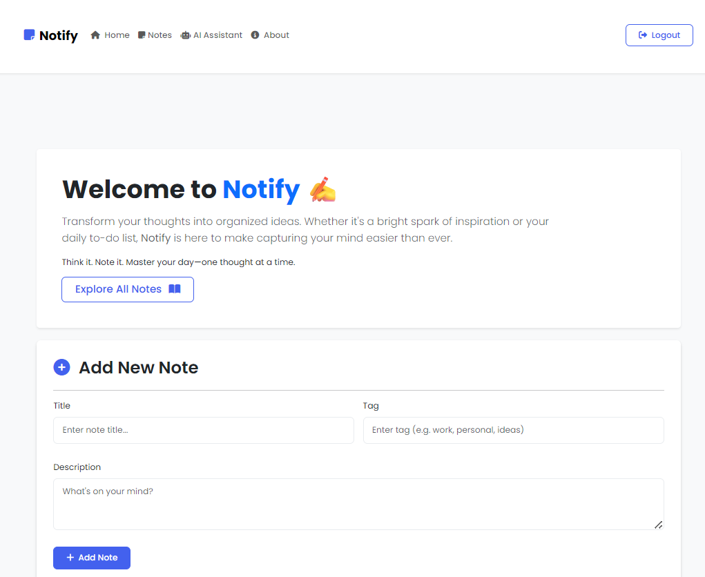
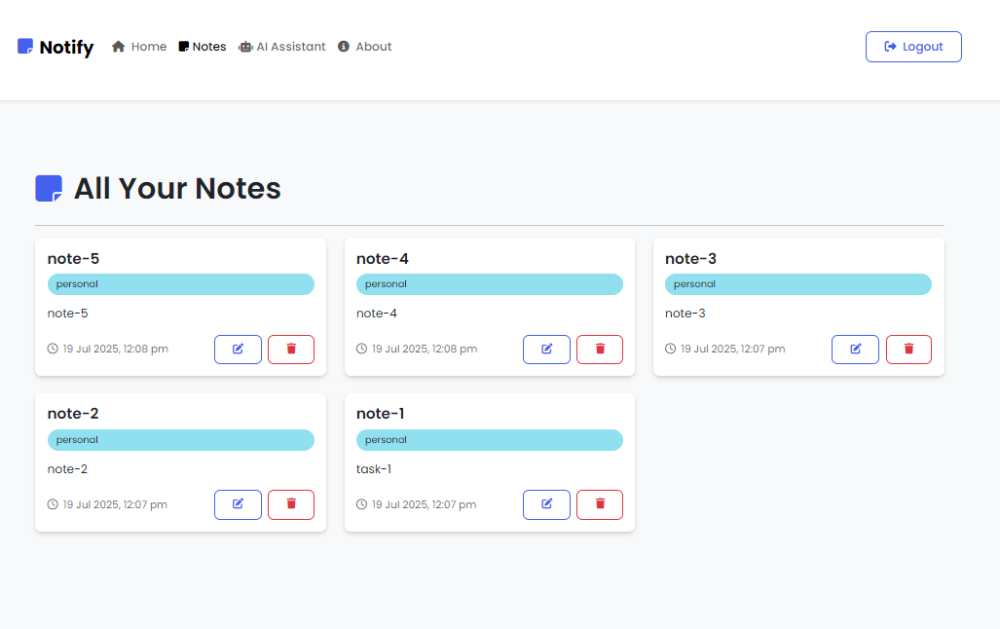
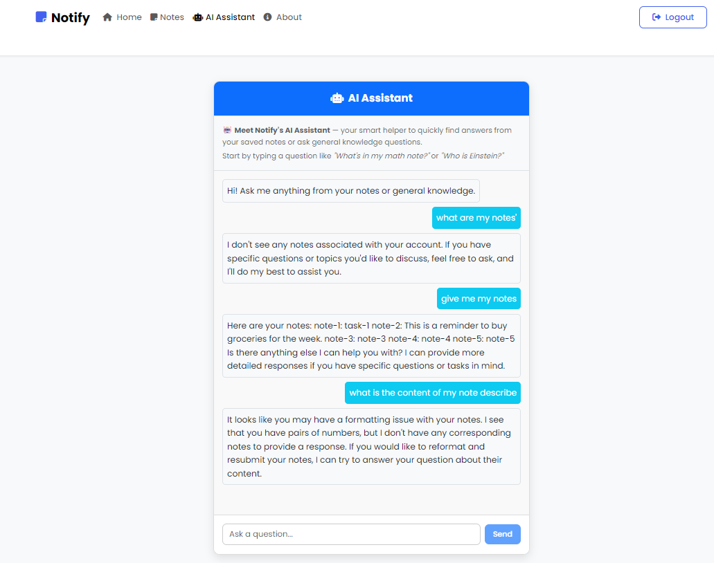

# 📝 Notify — Your Personal Notes App with AI Assistant

Notify is a full-stack MERN (MongoDB, Express, React, Node.js) web application that allows users to **securely create, manage, and access their personal notes from anywhere**. It features **JWT-based authentication** and a built-in **AI Assistant** that can answer user queries based on their stored notes and general knowledge.

---

## 🚀 Features

- ✅ **User Authentication**
  - Secure JWT-based login/signup system
  - Passwords are hashed before storage
  - Token-based session management

- 🗒️ **Personal Notes Management**
  - Create, edit, and delete notes
  - Access your notes anytime, anywhere
  - Fully responsive UI

- 🤖 **AI Assistant Integration**
  - Built-in chatbot powered by Cohere API
  - Answers user questions based on stored notes
  - General knowledge support when notes are not relevant

- 🌐 **Responsive Design**
  - Mobile-first, intuitive UI using Bootstrap
  - Works smoothly across all devices

- ☁️ **LocalStorage Support**
  - Chat history is saved locally for a seamless experience

---

## 🔐 Tech Stack

### Frontend
- **React.js**
- **React Router**
- **Bootstrap 5**
- **FontAwesome Icons**

### Backend
- **Node.js**
- **Express.js**
- **MongoDB**
- **Mongoose**
- **JWT (jsonwebtoken)**
- **CORS & Helmet (for security)**

### AI Integration
- **Cohere AI API**
  - Model used: `command-r-plus`
  - Chatbot responds intelligently using user notes as context

---

## 📸 Screenshots

| Home Page | Notes Dashboard | AI Assistant |
|-----------|------------------|--------------|
|  |  |  |
